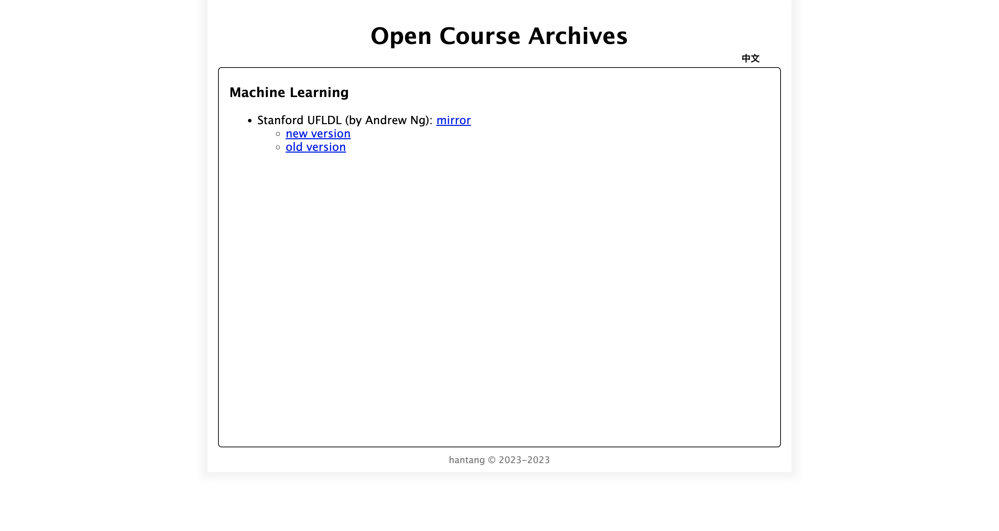
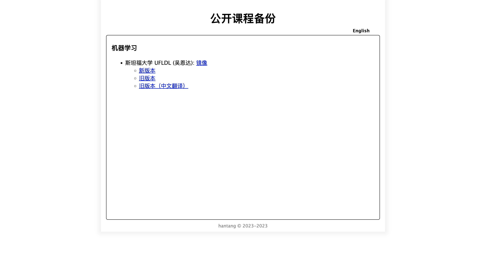
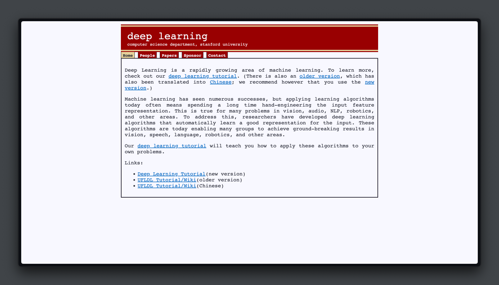
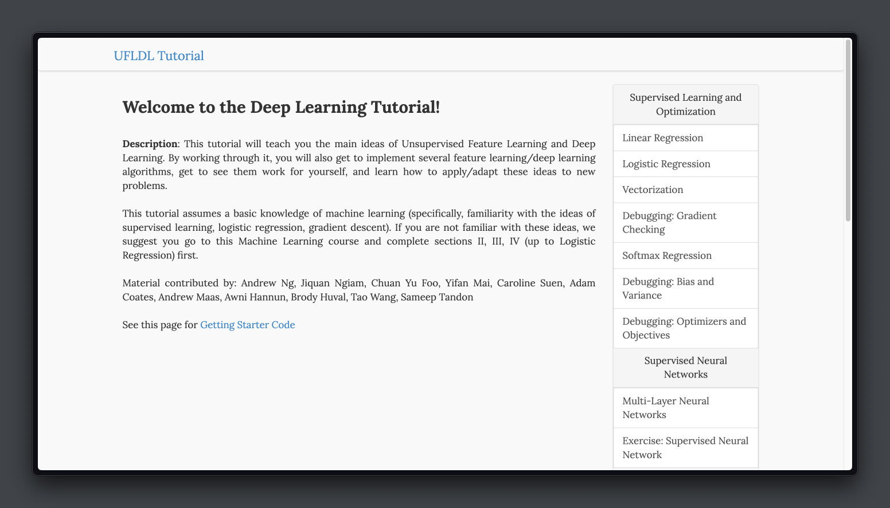
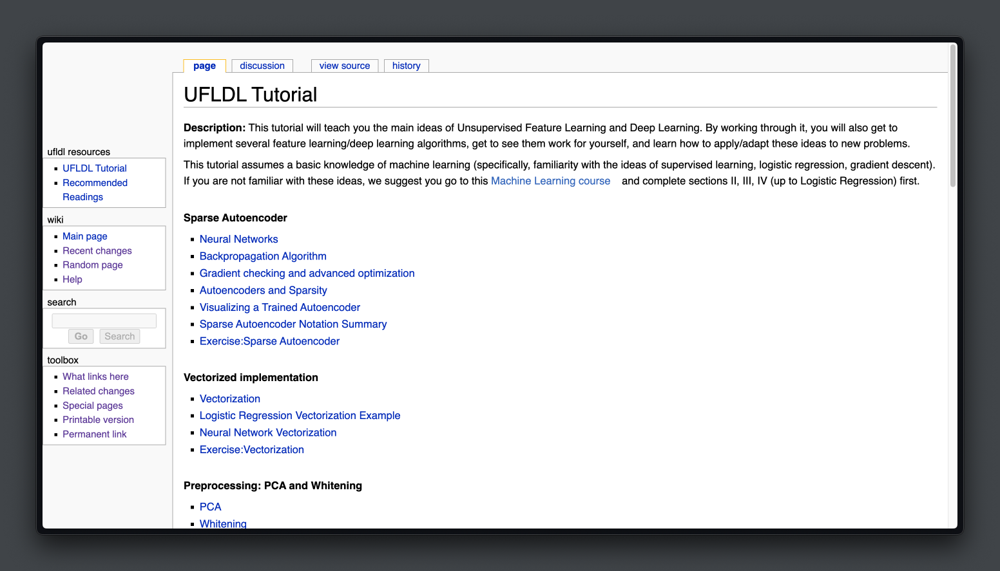

# wayback-mooc

Collect and backup some online mooc courses.

一些在线公开课程网站镜像备份。

## Open Course Archives

| site    | snapshot                    |
| ------- | --------------------------- |
| home    |     |
| chinese |  |

## Course List

- Stanford UFLDL (by Andrew Ng)
  - source: <http://ufldl.stanford.edu/>
  - mirror:
    - 
    - 
    - 
